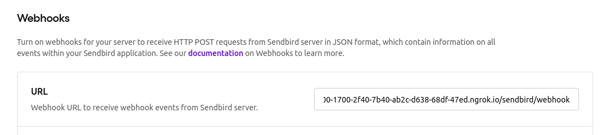

# Sendbird Profanity Notifier

## Start App in Development Environment

Install Dependencies:

`npm install`

Start Server:

`npm run dev`

Run [ngrok](https://ngrok.com/) to allow webhook access to http://localhost:3000/sendbird/webhook :

`./ngrok authtoken 26iqmqvjPuvk0U0KmollET0whyk_2qgakFDSwjMSHPvwHnmk7`

`./ngrok http 3000`

Navigate to the Webhook Settings page on the [SendBird Dashboard](https://dashboard.sendbird.com/) and enter the URL generated by ngrok, followed by `/sendbird/webhook`

Build React bundle:

`npm run build`

View `/client/src/index.html` in browser to begin using the app!
